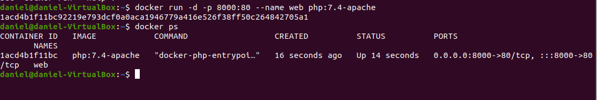
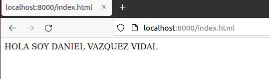
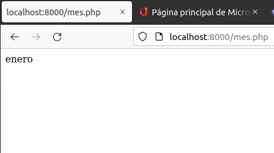
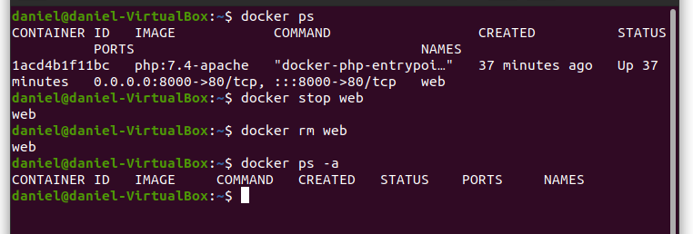

---
authors:Jairo Centeno Flores y Daniel Vazquez Vidal
--
title:Ejercicios Docker
---

# Tarea Docker

> Tarea realizada por: Jairo Centeno Flóres y Daniel Vázquez Vidal

[TOC]

## Ejercicio-Servidor web

1. Arranca un contenedor que ejecute una instancia de la imagen php:7.4-apache , que se llame web y que sea accesible desde un navegador en el puerto 8000.

2. Colocar en el directorio raíz del servicio web ( /var/www/html ) de dicho contenedor un fichero llamado index.html con el siguiente contenido:

3. Colocar en ese mismo directorio raíz un archivo llamado mes.php que muestre el nombre del mes actual. Ver la salida del script en el navegador.

4. Borrar el contenedor

