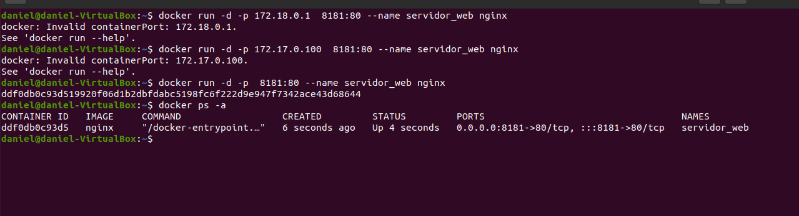

---
authors:Jairo Centeno Flores y Daniel Vazquez Vidal
--
title:Ejercicios Docker
---

# Tarea Docker

> Tarea realizada por: Jairo Centeno Flóres y Daniel Vázquez Vidal

[TOC]

## Ejercicio inicial

1. Pantallazo donde se vea la creación del contenedor y podamos comprobar que el contenedor está funcionando.

   

   

   

   

   

   

   

2. Pantallazo donde se vea el acceso al servidor web utilizando un navegador web (recuerda que tienes que acceder a la ip del ordenador donde tengas instalado docker)

3. Pantallazo donde se vean las imágenes que tienes en tu registro local.

4. Pantallazo donde se vea cómo se elimina el contenedor (recuerda que antes debe estar parado el contenedor).

