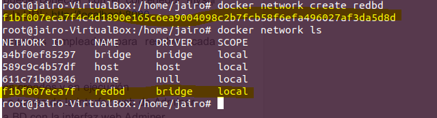
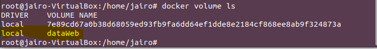
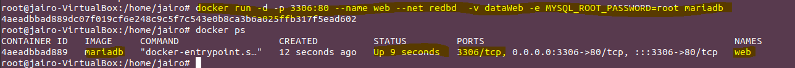
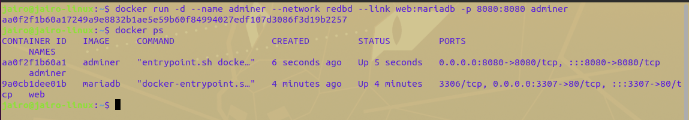
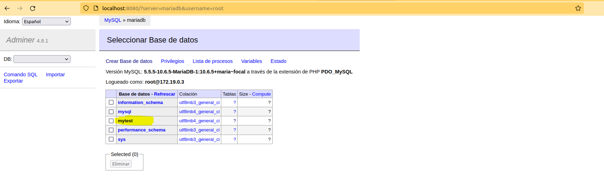
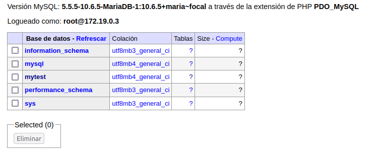
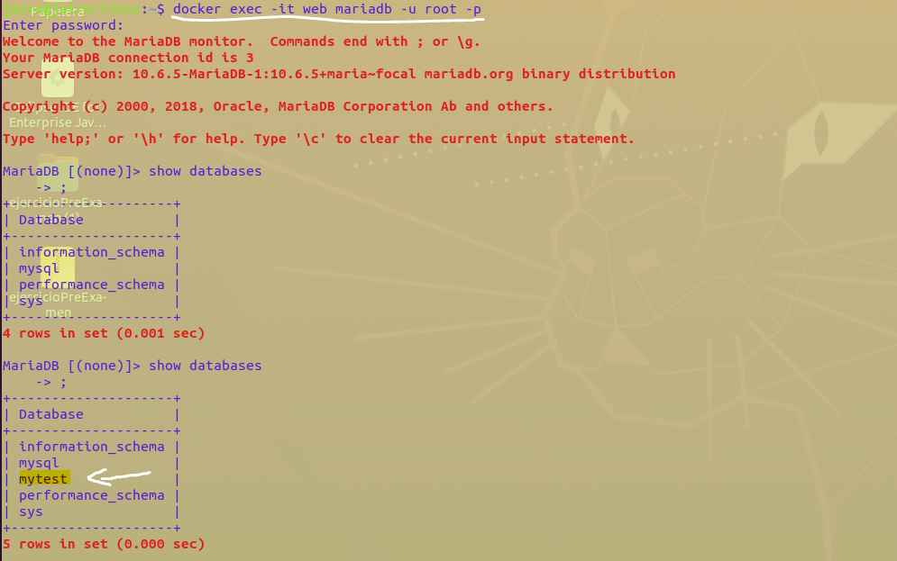
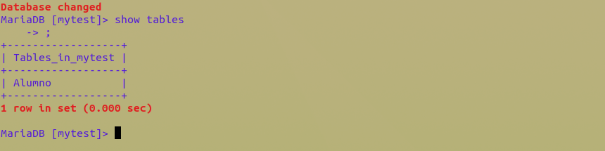

# Ejercicio - Redes

[TOC]

### Despliegue de contenedores en red: Adminer y MariaDB

#### 1. Crea un red Bridge `redbd`

```bash
docker create network redbd
```



#### 2. Crea un contenedor con una imagen de `mariaDB` que estará en la red `redbd`. Este contenedor se ejecutará en segundo plano, y sera accessible a traves del puerto `3306`. (Es necesario definir la contraseña del usuario `root` y un volumen de datos persistente)

Creamos un volumen de datos que lo definiremos como `dataWeb` con los comandos:

```bash
docker volume create dataWeb
```




```bash
docker run -d -p 3306:80 --name web --net redbd -v dataWeb -e MYSQL_ROOT_PASSWORD=root mariaDB
```




#### 3. Crear un contenedor con`Adminer` que se pueda conectar al contenedor de la BD.

```bash
docker run -d --name adminer --network redbd --link web:mariadb -p 8080:8080   adminer
```



#### 4. Comprobar con `adminer` que se pueda conectar  con el contenedor mysql abriendo un navegador web y accediento a la URL:  `http://localhost:8080`

Creamos  una base de datos en adminer, lo llamaremos "mytest"






> También podemos crear la base de datos desde el **cli**(command line interface) de la siguiente manera:
>
> ```mariadb
> create database mytest;
> #Si queremos usar la base de datos lo haremos con
> use mytest
> #Para mostrar las tablas
> show tables
> ```
>
> 


Comprobamos en consola si se ha creado la base de datos "mytest",primeramente accedemos a la base de datos con los siguientes comandos:

```bash
docker exec -it web mariadb -u root -p

```

```mariadb
 show databases;
```



Para cambiar de base de datos hacemos uso del comando:

```mariadb
use mytest
```



